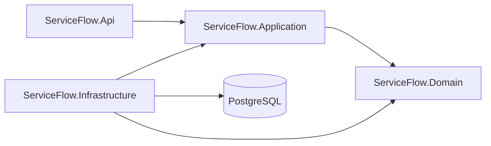

# ServiceFlow API

ServiceFlow is a portfolio backend project demonstrating production-style ASP.NET Core API development for a small service operations workflow.

## Overview

The API manages clients, service requests, comments, and audit logs. It uses PostgreSQL for persistence, demo JWT authentication for local walkthroughs, role-based authorization, FluentValidation, and predictable ProblemDetails error responses.

## Why this project exists

This project is designed to show how a backend can be built beyond a simple CRUD sample while still staying readable. It focuses on domain rules, API behavior, persistence, authorization, tests, and local operability.

## Features

- Client management with active and archived client states.
- Service request lifecycle with priorities, due dates, status transitions, and closing rules.
- Public and internal comments on service requests.
- Audit log retrieval for important request changes.
- Demo JWT authentication with Admin, Agent, and Viewer roles.
- FluentValidation request validation.
- ProblemDetails-style API errors.
- EF Core persistence with PostgreSQL.
- Docker Compose local runtime.
- Unit and integration tests, including authorization-sensitive API behavior.

## Tech Stack

- .NET 10
- ASP.NET Core Web API
- EF Core
- PostgreSQL
- FluentValidation
- JWT Bearer authentication
- xUnit
- Testcontainers
- Docker Compose
- GitHub Actions

## Architecture

ServiceFlow uses a Clean Architecture-style project structure:

- `ServiceFlow.Domain` contains entities, enums, and business rules.
- `ServiceFlow.Application` defines workflow contracts, commands, DTOs, and shared application exceptions.
- `ServiceFlow.Infrastructure` implements persistence and application services with EF Core.
- `ServiceFlow.Api` handles HTTP, validation, authentication, authorization, Swagger, and error responses.



## Domain Model

The core model includes:

- `Client`: customer/contact record with active/archive status.
- `ServiceRequest`: support or operations request tied to a client.
- `RequestComment`: public or internal comments on a request.
- `RequestAuditLog`: immutable record of important request changes.

Business rules live in the domain model where practical. Examples include required client names and emails, valid due dates, critical request due-date requirements, explicit status transitions, closed request behavior, comment body validation, and audit entry creation for status and priority changes.

## API Capabilities

The API exposes:

- `GET /health`
- `POST /api/auth/demo-token`
- `/api/clients`
- `/api/service-requests`
- `/api/service-requests/{id}/comments`
- `/api/service-requests/{id}/audit-log`

Swagger is available in local development.

## Authentication And Roles

Authentication is intentionally a demo JWT flow for local development and portfolio review. It is not a production identity provider and does not include passwords, refresh tokens, external providers, or a user database.

Roles:

- `Admin`: full access to clients, service requests, comments, and audit logs.
- `Agent`: read clients; manage service requests; add/read comments; read audit logs.
- `Viewer`: read clients and service requests; read public comments only.

## Running Locally

Start PostgreSQL:

```bash
docker compose up -d postgres
```

Apply migrations:

```bash
~/.dotnet/dotnet tool restore
~/.dotnet/dotnet dotnet-ef database update \
  --project src/ServiceFlow.Infrastructure \
  --startup-project src/ServiceFlow.Infrastructure
```

Run the API:

```bash
~/.dotnet/dotnet run --project src/ServiceFlow.Api
```

Default local URLs:

- API: `http://localhost:5234`
- Swagger: `http://localhost:5234/swagger`

## Running With Docker

Run the full local stack:

```bash
docker compose up --build
```

This starts PostgreSQL and the API. The API uses the Docker internal PostgreSQL host name `postgres`, runs in `Development`, and listens on:

```text
http://localhost:8080
```

Swagger:

```text
http://localhost:8080/swagger
```

The Docker Compose credentials are development-only defaults. They can be overridden with environment variables or a local `.env` file based on `.env.example`.

## Demo Tokens

Get an Admin token:

```bash
curl -X POST http://localhost:8080/api/auth/demo-token \
  -H "Content-Type: application/json" \
  -d '{"userId":"11111111-1111-1111-1111-111111111111","displayName":"Demo Admin","role":"Admin"}'
```

Use the returned token:

```bash
curl http://localhost:8080/api/clients \
  -H "Authorization: Bearer <accessToken>"
```

For write actions that persist a user identifier, such as comments, use a GUID `userId` because the domain stores user IDs as GUIDs.

More examples are in [docs/api-examples.md](docs/api-examples.md).

## Database And Migrations

Migrations live in `ServiceFlow.Infrastructure`. The design-time context factory uses the local Docker PostgreSQL connection string by default and can be overridden with `ConnectionStrings__ServiceFlowDb`.

In `Development`, setting `SeedData__RunOnStartup=true` runs migrations and adds demo data when the database is empty. Docker Compose enables this by default for a usable local demo stack.

## Testing

Run all tests:

```bash
~/.dotnet/dotnet test ServiceFlow.slnx
```

Integration tests use Testcontainers and require Docker.

Useful validation commands:

```bash
~/.dotnet/dotnet restore ServiceFlow.slnx
~/.dotnet/dotnet build ServiceFlow.slnx --no-restore
~/.dotnet/dotnet test ServiceFlow.slnx --no-build
~/.dotnet/dotnet format ServiceFlow.slnx --verify-no-changes --no-restore
```

## CI

GitHub Actions runs restore, build, tests, and format verification on pushes to `main` and pull requests. The workflow is defined in `.github/workflows/ci.yml`.

## Design Decisions

- Controller-based API instead of Minimal APIs to keep the HTTP surface familiar and explicit.
- Demo JWT authentication instead of a real identity provider so the portfolio project is easy to run locally.
- Explicit application services instead of MediatR for readability and lower ceremony.
- PostgreSQL `xmin` is mapped as a row-version placeholder for optimistic concurrency support.
- ProblemDetails responses provide predictable API errors for validation, missing resources, domain failures, and authorization behavior.
- Role-based comment visibility keeps internal support notes hidden from Viewer users.

## Project Roadmap

Realistic next improvements:

- Replace demo auth with Keycloak, Auth0, or another production identity provider.
- Add OpenTelemetry tracing and metrics.
- Add background jobs for SLA reminders.
- Add API versioning.
- Build a frontend dashboard for support agents.
- Add a deployment pipeline for a staging environment.
